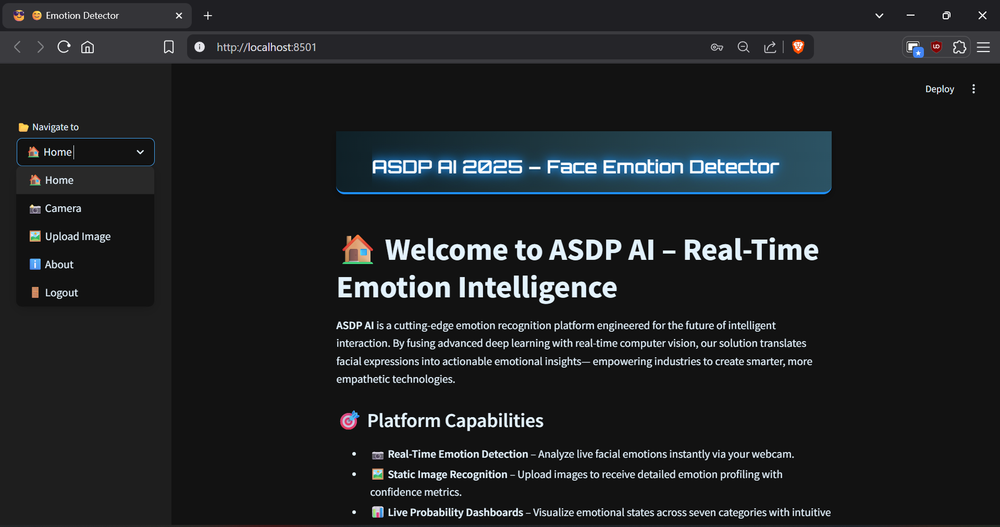
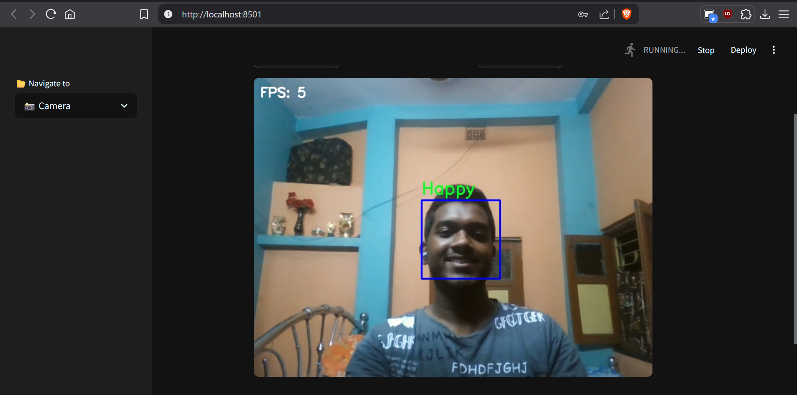
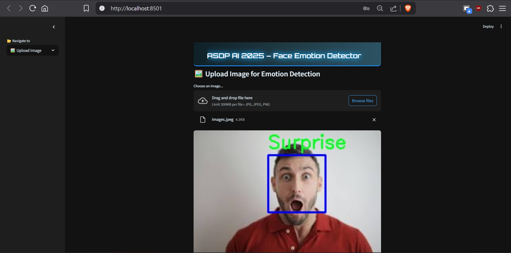

# 😄 ASDP AI – Face Emotion Detector

**ASDP AI** is a real-time facial emotion recognition web application developed using **Streamlit**, **OpenCV**, and a custom **CNN-based deep learning model** trained on a rebalanced **FER-2013** dataset. The app allows users to detect emotions from both live webcam feeds and uploaded images in a user-friendly interface.

---

## 🚀 Features

- 🔐 **Secure Login System** – Basic user authentication
- 📸 **Real-Time Emotion Detection** – Detects emotions from webcam input
- 🖼️ **Image Upload Analysis** – Detects emotions in static uploaded images
- 📊 **Confidence Score Visualization** – Displays probabilities for each emotion
- 👥 **About Page** – Developer information and contact section

---

## 🧠 Model Overview

| Detail         | Description                                  |
|----------------|----------------------------------------------|
| **Architecture** | Custom 5-layer CNN                        |
| **Dataset**      | FER-2013 (balanced: 5,000 images/class)   |
| **Accuracy**     | ~70% on test set                          |
| **Preprocessing**| Grayscale, normalization, class rebalancing |
| **Frameworks**   | TensorFlow, Keras, OpenCV                 |

---

## 📁 Project Structure

```bash
emotion-recognition-app/
├── app.py                         # Main Streamlit application
├── emotion_recognition_model.keras  # Trained CNN model
├── data balancing.ipynb           # Dataset rebalancing notebook
├── model Tranning.ipynb           # CNN training notebook
├── requirements.txt               # Python dependencies
├── README.md                      # Project documentation
├── assets/                        # UI images and icons
└── .streamlit/                    # Streamlit config files
``` 
## ⚙️ Installation & Setup

To run this app locally:

### 1. Clone the Repository

```bash
git clone git@github.com:snehashis842/emotion-recognition-app.git
cd emotion-recognition-app
```


### 2. **Install Dependencies**
```bash
pip install -r requirements.txt
```

### 3. **Launch the Application**
```bash
streamlit run app.py
```
## 📸 Screenshots

### 🏠 Home Interface


### 🎥 Webcam Detection


### 🖼️ Image Upload Result


---

## 🙋‍♂️ Developer Profile

**👨‍💻 Snehashis Das** 
!(assets/snehashis.jpg)
---
*Lead Developer & Project Architect*

- 📧 Email: [snehashisdas842@gmail.com](mailto:snehashisdas842@gmail.com)  
- 🌐 GitHub: [snehashis842](https://github.com/snehashis842)  
- 🔗 LinkedIn: [linkedin.com/in/snehashisdas](https://www.linkedin.com/in/snehashisdas-/)

---

## 🛠️ Tech Stack

| Category           | Tools & Technologies             |
|--------------------|----------------------------------|
| **Language**       | Python                           |
| **Frontend**       | Streamlit, HTML, CSS             |
| **Computer Vision**| OpenCV                           |
| **Deep Learning**  | TensorFlow, Keras                |
| **Data Handling**  | NumPy, Pandas                    |
| **Visualization**  | Matplotlib, Seaborn              |
| **Version Control**| Git, GitHub                      |

---

## 📈 Future Improvements

- 🚀 Deploy to Streamlit Cloud for public access  
- 📊 Add user session analytics  
- 📸 Multi-face detection & tracking  
- 🧠 Improve model accuracy with deeper architecture  
- 🤳 Expand dataset with user-submitted images  

---

## 📄 License

This project is intended for academic and educational use only.  
For reuse, extension, or commercial applications, please contact the developer.

---

## ⭐️ Support

If you found this project useful, please consider giving it a ⭐ on [GitHub](https://github.com/snehashis842/emotion-recognition-app)!
